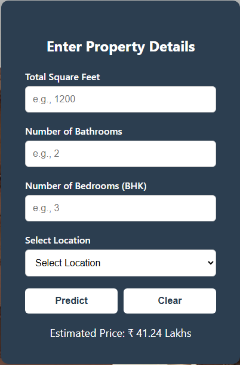

# 🏠 Bengaluru House Price Prediction

This project is a machine learning-based web application that predicts house prices in Bengaluru, India, based on input features like location, square footage, number of bedrooms, bathrooms, and more.

## 📌 Problem Definition

Predicting house prices accurately helps buyers, sellers, and real estate professionals make informed decisions. This regression problem uses various housing features to estimate market value.

## 📊 Dataset

- **Source**: Kaggle - [Bengaluru House Price Data](https://www.kaggle.com/datasets)
- **Size**: ~13,000 rows, 9 columns
- **Format**: CSV

## ⚙️ Features Used

- `location`: Area or neighborhood
- `total_sqft`: Total square footage of the property
- `bath`: Number of bathrooms
- `bhk`: Number of bedrooms
- `price_per_sqft`: Engineered feature
- `availability`: Property availability status
- `area_type`: Super built-up, plot, etc.

## 🧹 Data Preprocessing

- Removed outliers and missing values
- Converted `total_sqft` strings to numeric values
- Encoded categorical variables (e.g., location)
- Created new features like `price_per_sqft`
- Scaled numerical features using `StandardScaler`

## 🤖 Model Building

Three regression models were trained and evaluated:
1. **Linear Regression** – baseline model
2. **Random Forest Regressor** – ensemble learning
3. **Gradient Boosting Regressor** – performance-focused

## 🧪 Model Evaluation

<table border="1" class="dataframe">
  <thead>
    <tr style="text-align: right;">
      <th></th>
      <th>model</th>
      <th>best_score</th>
      <th>best_params</th>
    </tr>
  </thead>
  <tbody>
    <tr>
      <th>0</th>
      <td>linear_regression</td>
      <td>0.847796</td>
      <td>{'positive': False}</td>
    </tr>
    <tr>
      <th>1</th>
      <td>lasso</td>
      <td>0.726738</td>
      <td>{'alpha': 2}</td>
    </tr>
    <tr>
      <th>2</th>
      <td>ridge</td>
      <td>0.846798</td>
      <td>{'alpha': 1}</td>
    </tr>
    <tr>
      <th>3</th>
      <td>elasticnet</td>
      <td>0.744950</td>
      <td>{'alpha': 0.1, 'l1_ratio': 0.8}</td>
    </tr>
    <tr>
      <th>4</th>
      <td>decision_tree</td>
      <td>0.743388</td>
      <td>{'criterion': 'squared_error', 'max_depth': 20}</td>
    </tr>
    <tr>
      <th>5</th>
      <td>random_forest</td>
      <td>0.795851</td>
      <td>{'max_depth': 20, 'n_estimators': 50}</td>
    </tr>
    <tr>
      <th>6</th>
      <td>gradient_boosting</td>
      <td>0.777778</td>
      <td>{'learning_rate': 0.1, 'max_depth': 5, 'n_esti...</td>
    </tr>
    <tr>
      <th>7</th>
      <td>knn</td>
      <td>0.683079</td>
      <td>{'n_neighbors': 5}</td>
    </tr>
  </tbody>
</table>

> Best performance: ✅ **Gradient Boosting Regressor**

## 🌐 Web App (Flask)

A Flask web interface allows users to:
- Enter housing details
- Select location, size, and other features
- Get a **predicted price** instantly

### Screenshots

## 🚀 How to Run Locally

--- bash
# Clone the repository
git clone https://github.com/Davischoice1/houseworth.git
cd house_price_prediction

# Create virtual environment
python -m venv venv
source venv/Scripts/activate  # or venv/bin/activate

# Install dependencies
pip install -r requirements.txt

# Run the Flask app
python app.py
